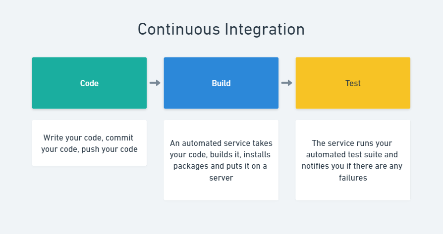

# Continuous Integration, Deployment & Delivery

## Learning Objectives

- Explain the differences between integration, deployment and delivery during automated workflows
- Use a continuous workflow to deploy an application

## Introduction

Continuous automation is the process of taking code written by a developer and performing some automated task with it in order to remove the manual bottleneck that comes with testing a piece of software.

There are 3 flavours of automation:

1. Continuous Integration
2. Continuous Deployment
3. Continuous Delivery

The approach used largely depends on the team needs, with Continuous Delivery & Integration being the most common.

## Continuous Integration (CI)

You've been doing this on the Boolean course already! CI is the process of taking a developer's code and automatically running tests on it. If you check your previous pull requests, your latest commits should have either a green check mark or a red X attached.

This is continuous integration - your code is cloned into an automated service, which then installs all of the packages defined in your `package.json` file and runs any tests included in the project. If all tests pass, you get a green check - if even one fails, you get a red X.

This process helps the dev team to know if merging a feature into the `main` branch is likely to cause issues.

## Continuous Deployment (CD)

Like CI, continuous deployment automates the testing of your commits. CD will introduce another automated step after testing - deployment! With CD, your code changes will automatically be published to the live application if all of the tests are passing.

As you can probably imagine, this comes with a bit of a trade-off. It removes the need for any human interaction, stream-lining the process, but it can also open up the possibility of high priority bugs making their way into your live app.

## Continuous Delivery (also CD)

Continuous delivery is usually the method referenced when somebody says "CD". It's almost exactly the same as Continuous Deployment, except we introduce a manual step before a deployment happens. This allows us to stream-line _most_ of the deployment process, but requires a real human to press a button that triggers the automated deployment. With this approach, we can have a manual tester check that the app has no bugs before the deployment happens.

